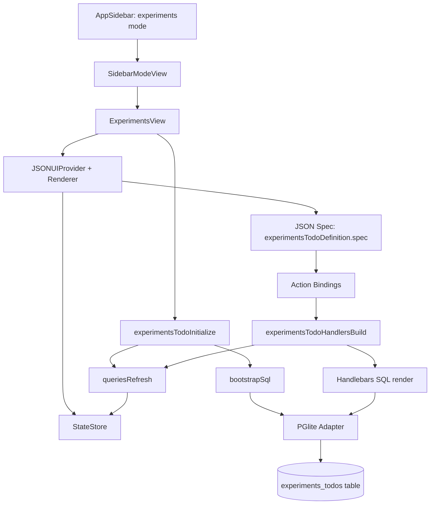
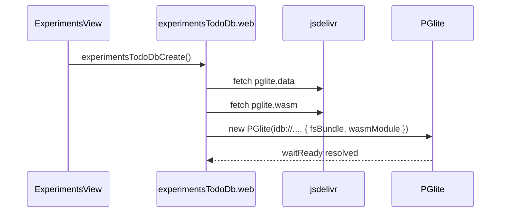
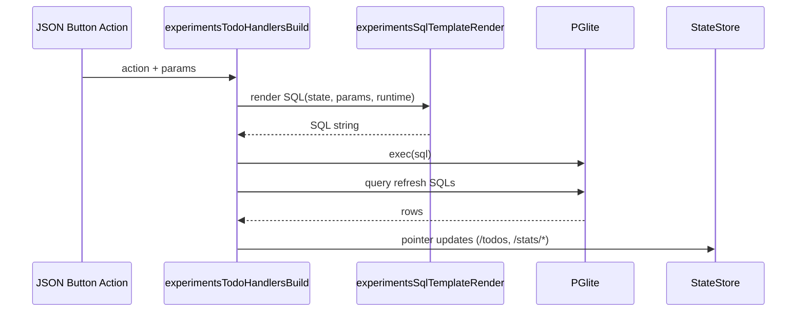
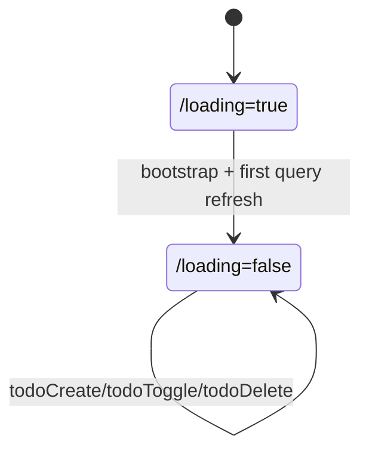
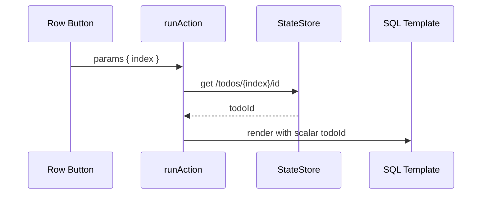

# Daycare App: Experiments Sidebar (JSON Render + PGlite)

## Summary
- Added a new `experiments` section in the app sidebar and mode routing.
- Introduced `ExperimentsView`, rendered via `@json-render/react-native`.
- Backed todo persistence with PGlite (`idb://daycare-experiments-v1`) on web runtime.
- Moved to a static JSON definition (`experimentsTodoDefinition`) that contains:
  - initial renderer state
  - a series of SQL query snapshots
  - SQL action templates rendered with Handlebars
  - the UI spec itself
- Wired action handlers to run templated SQL and refresh only declared query snapshots.

## Architecture


## PGlite Schema
```sql
CREATE TABLE IF NOT EXISTS experiments_todos (
    id TEXT PRIMARY KEY,
    title TEXT NOT NULL,
    done BOOLEAN NOT NULL DEFAULT FALSE,
    created_at BIGINT NOT NULL
);
CREATE INDEX IF NOT EXISTS idx_experiments_todos_created_at
    ON experiments_todos (created_at DESC);
```

## Web Runtime Note
The web adapter now loads `pglite.data` and `pglite.wasm` explicitly from a pinned CDN URL and passes them to PGlite as `fsBundle` and `wasmModule`. This avoids Metro resolving assets relative to the dev bundle URL, which caused an FS bundle size mismatch at runtime.



## SQL-Templated Actions
Every UI action compiles a SQL template via Handlebars (`{{sql ...}}`) with context:
- `state`: full renderer snapshot
- `params`: resolved action params from JSON-render bindings
- `runtime`: generated values (`generatedId`, `now`)



## Loading Behavior
`/loading` is now reserved for the first bootstrap only (`experimentsTodoInitialize`). Action handlers no longer toggle loading, so create/toggle/delete runs without showing the loading card.



## Row Action Params
Row buttons now pass `index` (`$index`) and handlers resolve `todoId` from `/todos/<index>/id` before SQL templating. This avoids silent no-op updates when non-scalar params are provided.


