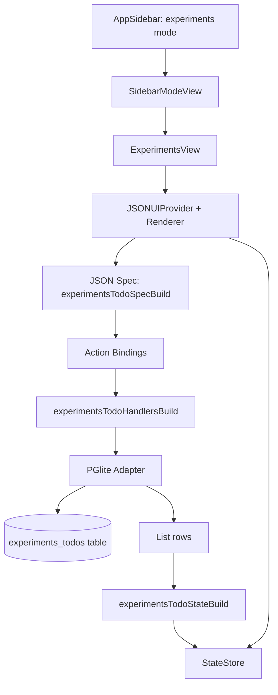

# Daycare App: Experiments Sidebar (JSON Render + PGlite)

## Summary
- Added a new `experiments` section in the app sidebar and mode routing.
- Introduced `ExperimentsView`, rendered via `@json-render/react-native`.
- Backed todo persistence with PGlite (`idb://daycare-experiments-v1`) on web runtime.
- Wired JSON actions (`todoCreate`, `todoToggle`, `todoDelete`) to PGlite mutations and state refresh.

## Architecture


## PGlite Schema
```sql
CREATE TABLE IF NOT EXISTS experiments_todos (
    id TEXT PRIMARY KEY,
    title TEXT NOT NULL,
    done BOOLEAN NOT NULL DEFAULT FALSE,
    created_at BIGINT NOT NULL
);
CREATE INDEX IF NOT EXISTS idx_experiments_todos_created_at
    ON experiments_todos (created_at DESC);
```

