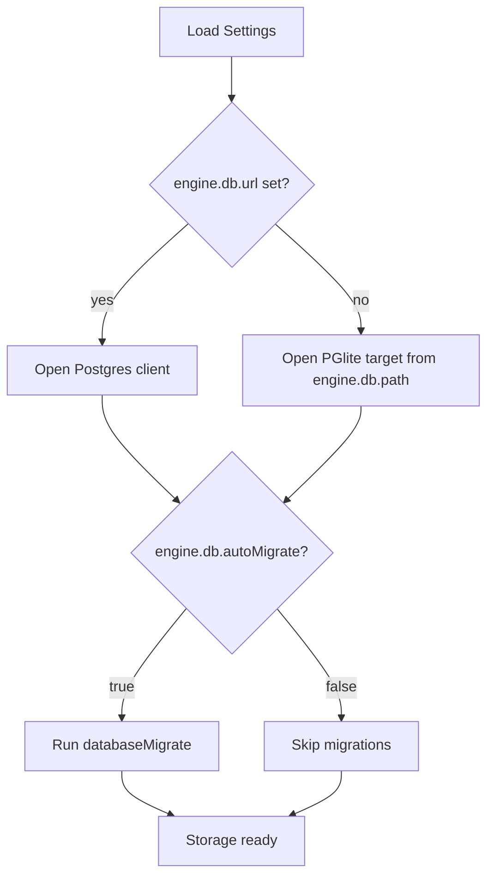

# Storage DB Target Settings

Date: 2026-02-26

## Summary

This change adds explicit settings for:

- Selecting a server database via `engine.db.url`
- Toggling automatic migrations via `engine.db.autoMigrate`

If `engine.db.url` is set, storage opens a server Postgres connection.
If not set, storage continues using local PGlite path resolution.

## Config Fields

- `engine.db.path`: local database path (used for PGlite target)
- `engine.db.url`: optional server database URL
- `engine.db.autoMigrate`: optional boolean (default `true`)

## Runtime Flow

## Notes

- `storageResolve` cache keys now include backend kind to avoid collisions.
- `storageUpgrade` follows the same target selection (`postgres` vs `pglite`).
- Config parsing no longer enforces a `postgres://` URL prefix.
