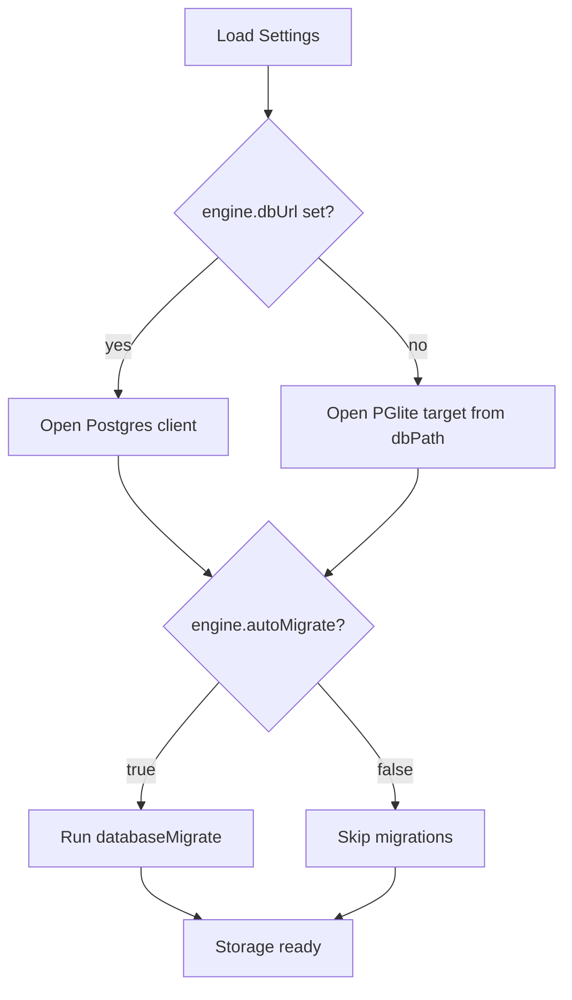

# Storage DB Target Settings

Date: 2026-02-26

## Summary

This change adds explicit settings for:

- Selecting a server Postgres database via `engine.dbUrl`
- Toggling automatic migrations via `engine.autoMigrate`

If `engine.dbUrl` is set, storage opens a server Postgres connection.
If not set, storage continues using local PGlite path resolution.

## Config Fields

- `engine.dbPath`: local database path (used for PGlite target)
- `engine.dbUrl`: optional Postgres connection URL (`postgres://` or `postgresql://`)
- `engine.autoMigrate`: optional boolean (default `true`)

## Runtime Flow

## Notes

- `storageResolve` cache keys now include backend kind to avoid collisions.
- `storageUpgrade` follows the same target selection (`postgres` vs `pglite`).
