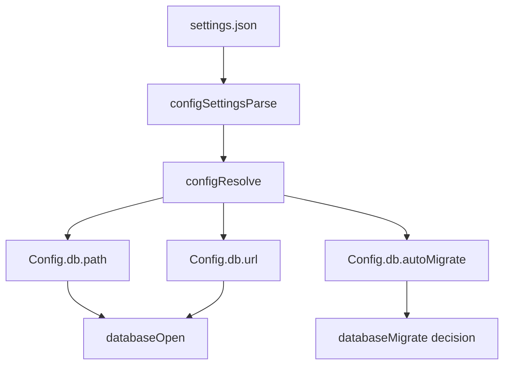

# Move DB settings under `engine.db`

Date: 2026-02-27

## Summary
- Moved database settings from flat engine keys to nested db settings.
- Old shape: `engine.path`, `engine.url`, `engine.autoMigrate`.
- New shape: `engine.db.path`, `engine.db.url`, `engine.db.autoMigrate`.
- Runtime `Config` now exposes `config.db.path`, `config.db.url`, and `config.db.autoMigrate`.

## Runtime wiring

## Updated consumers
- `engine.ts` now reads `config.current.db.*`.
- `storageResolve.ts` now reads `config.db.*` and keys cache by nested db target.
- `storageUpgrade.ts` now opens/labels targets from `config.db.*`.
- Config parsing/resolution tests updated to the nested db shape.
