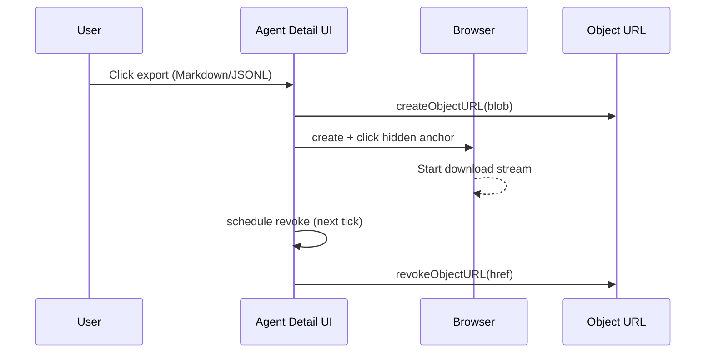

# Dashboard Export Download Completion

## Problem

Markdown and JSONL exports from the dashboard occasionally remained stuck as unfinished downloads in browsers.

## Root Cause

The dashboard revoked the generated Blob URL immediately after triggering `anchor.click()`.
Some browsers still need the object URL alive for a short time while the download stream attaches.

## Change

- Added `downloadTextFile()` helper in `packages/daycare-dashboard/lib/downloadTextFile.ts`.
- Moved export download calls in `agentDetailClient.tsx` to use this helper.
- Deferred Blob URL revocation with a scheduled callback (`setTimeout(..., 0)`).
- Added a unit test to ensure revocation is asynchronous.

## Flow

