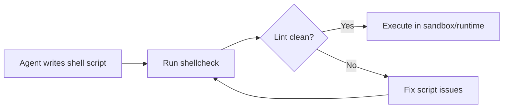

# Daycare Runtime: Add ShellCheck

## Summary
- Added `shellcheck` to the base apt package list in both runtime images:
  - `packages/daycare-runtime/Dockerfile`
  - `packages/daycare-runtime/Dockerfile.minimal`
- Version is pinned with wildcard: `shellcheck=0.9.*`.

## Why
- Improves shell script reliability by catching quoting, globbing, and portability mistakes before runtime.

## Package Flow

