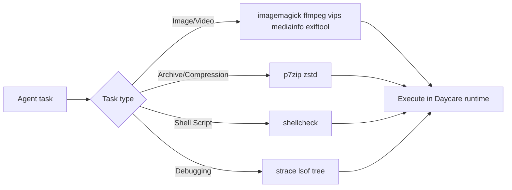

# Daycare Runtime: Install Recommended Tooling Bundle

## Summary
- Added the full recommended tooling bundle to both runtime images:
  - `packages/daycare-runtime/Dockerfile`
  - `packages/daycare-runtime/Dockerfile.minimal`
- Added packages:
  - `ffmpeg`
  - `imagemagick`
  - `libvips-tools`
  - `libimage-exiftool-perl`
  - `mediainfo`
  - `shellcheck`
  - `strace`
  - `lsof`
  - `tree`
  - `p7zip-full`
  - `zstd`

## Why
- Expands media conversion/inspection capabilities and improves diagnostics and script quality checks in sandbox runtime environments.

## Runtime Tooling Flow

