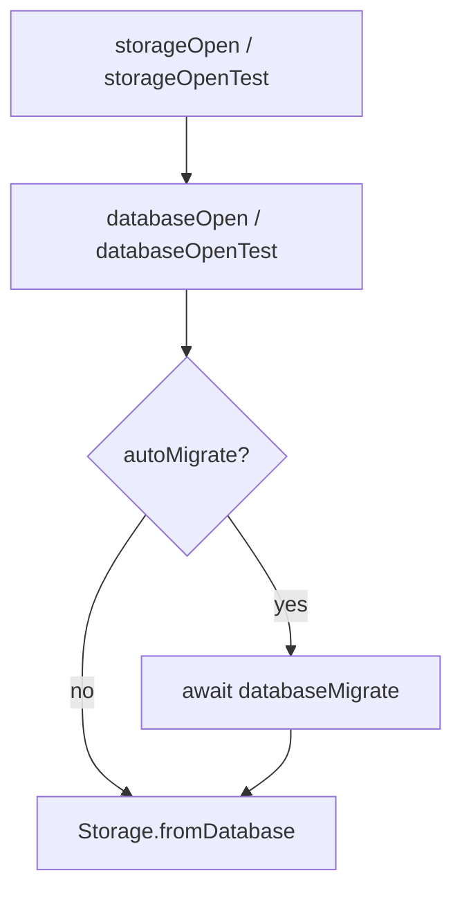

# Async storageOpen and storageOpenTest

## Summary
- Made `storageOpen` asynchronous and migration-aware via `await databaseMigrate(...)`.
- Made `storageOpenTest` asynchronous and migration-aware via `await databaseMigrate(...)`.
- Updated all test call sites to `await storageOpenTest()` so schema setup completes before repository usage.
- Kept `storageResolve` synchronous for existing runtime call paths, while preserving `dbAutoMigrate` fire-and-forget behavior.

## Flow

## Notes
- This prevents test/runtime paths that use `storageOpen*` from racing schema migration against repository operations.
- Runtime paths that rely on `storageResolve` remain synchronous by design.
