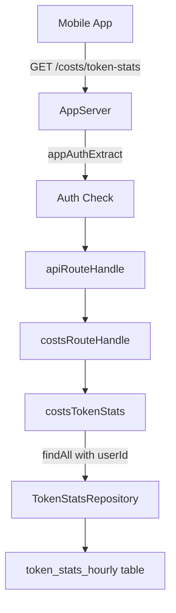
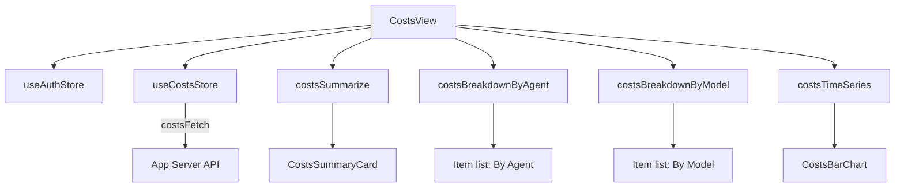

# Usage Cost Visualization in Mobile App

Date: 2026-02-28

## Summary
- Added `GET /costs/token-stats` route to the app-server so the mobile app can fetch token usage data.
- Replaced hardcoded mock data in `CostsView` with real API-driven visualizations.
- Added bar chart (cost over time), summary card, and breakdown lists (by agent and model).
- Period selector (24h, 7d, 30d) controls the time range.

## Backend route

### Route: `GET /costs/token-stats`
Query params: `from`, `to`, `agentId`, `model`, `limit` (all optional).
Response: `{ ok: true, rows: TokenStatsRow[] }`.
Scoped to the authenticated user via `findAll({ userId: ctx.userId })`.

## Frontend architecture

### Data layer (`modules/costs/`)
- **costsStoreCreate** — Zustand store: period, rows, loading, error, fetch action
- **costsFetch** — HTTP client with Bearer auth
- **costsSummarize** — Aggregate totals from rows
- **costsBreakdownByAgent** — Group by agentId, sorted by cost desc
- **costsBreakdownByModel** — Group by model, sorted by cost desc
- **costsTimeSeries** — Hourly buckets with gap-filling
- **costsPeriodRange** — Convert period label to `{ from, to }` timestamps
- **costsFormatCurrency** — USD formatting

### View components (`views/costs/`)
- **CostsPeriodSelector** — Wraps SegmentedControl with 24h/7d/30d
- **CostsSummaryCard** — Large total + token breakdown stats
- **CostsBarChart** — Plain View-based bar chart, no extra dependencies

## Files changed

### Backend (`packages/daycare`)
- `sources/api/routes/costs/costsTokenStats.ts` (new)
- `sources/api/routes/costs/costsRoutes.ts` (new)
- `sources/api/routes/routes.ts` (modified — added costs dispatch + tokenStatsFetch)
- `sources/api/app-server/appServer.ts` (modified — threading tokenStatsFetch)
- `sources/engine/engine.ts` (modified — pass tokenStatsFetch callback)

### Frontend (`packages/daycare-app`)
- `sources/modules/costs/` (new — 8 files + 4 spec files)
- `sources/views/costs/` (new — 3 view components)
- `sources/views/CostsView.tsx` (rewritten)
