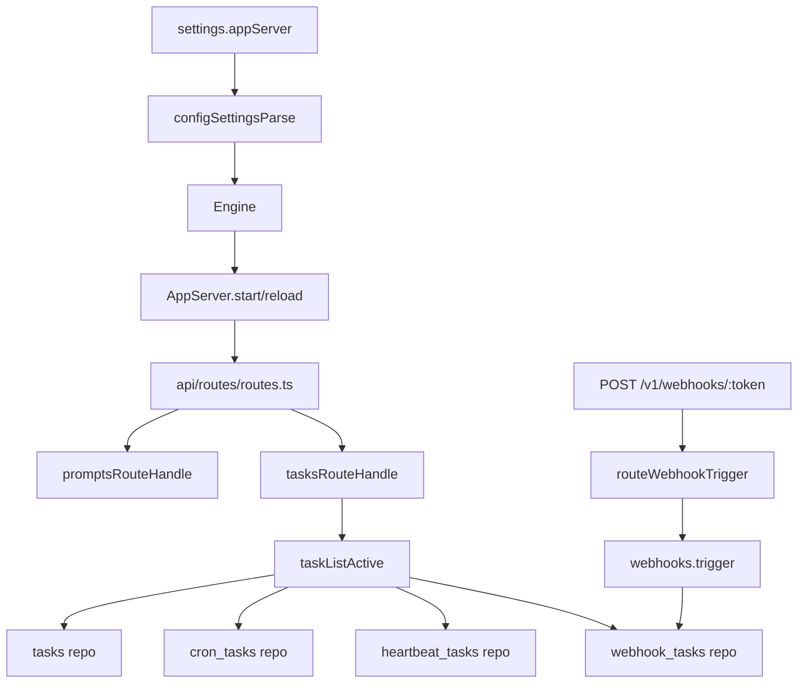

# Move App Server to Core API and Route Subfolders

Date: 2026-02-28

## Summary
- Moved Daycare app server runtime from plugin space to core API under `sources/api/app-server`.
- Reorganized API handlers into `sources/api/routes/` with domain subfolders.
- Replaced plugin-scoped app server configuration with top-level `settings.appServer`.
- Added authenticated `GET /tasks/active` endpoint to list active tasks, their triggers, and last execution timestamps.
- Persisted webhook trigger execution time (`lastRunAt`) so webhook tasks report last execution consistently with cron and heartbeat tasks.

## Runtime wiring

## Layout changes
- Removed plugin implementation from `sources/plugins/daycare-app-server/`.
- Added core app server module at `sources/api/app-server/`.
- Moved route dispatcher from `sources/api/routes.ts` to `sources/api/routes/routes.ts`.
- Moved prompts handlers to `sources/api/routes/prompts/`.
- Added tasks handlers to `sources/api/routes/tasks/`.

## Behavior changes
- App server is enabled by `settings.appServer.enabled` (default `false`).
- App auth link command/tool continue to use the same host/port/endpoint/jwt settings, now resolved from top-level `settings.appServer`.
- Telegram WebApp URL resolution now checks `settings.appServer.enabled` and reads endpoint settings from `settings.appServer`.
