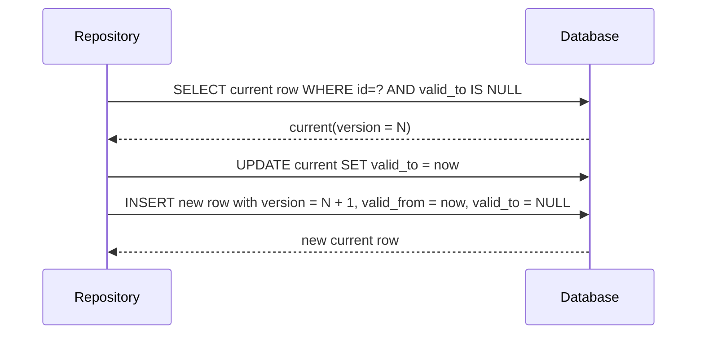
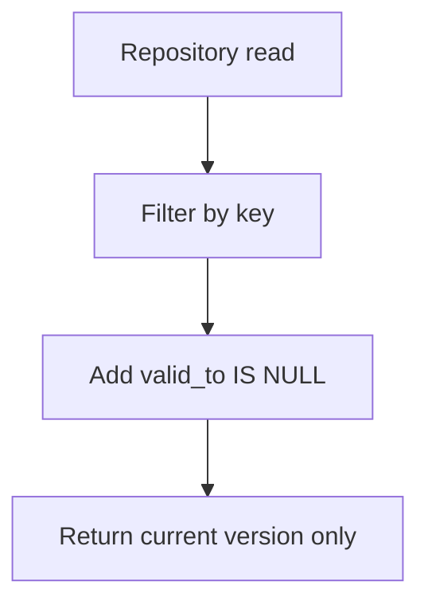
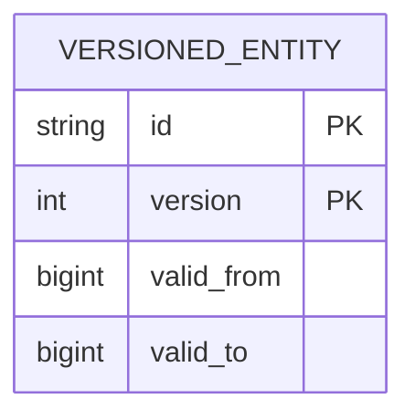

# Entity Versioning

## Summary

This change adds temporal versioning to 12 mutable entities:

- `users`
- `agents`
- `tasks`
- `tasks_cron`
- `tasks_heartbeat`
- `tasks_webhook`
- `signals_subscriptions`
- `channels`
- `expose_endpoints`
- `processes`
- `connections`
- `system_prompts`

Each row now includes:

- `version` (integer, starts at `1`)
- `valid_from` (unix timestamp in ms)
- `valid_to` (`NULL` for current row, unix timestamp for closed rows)

Primary keys now include `version`, and repository reads always target current rows via `valid_to IS NULL`.

## Write Pattern

## Read Pattern

## Table Shape

## Notes

- In-place `UPDATE` is replaced by close-and-insert version advance.
- Deletes for versioned entities close the current row by setting `valid_to`.
- Unique constraints that represent current state are partial unique indexes with `WHERE valid_to IS NULL`.
- Foreign keys pointing to versioned entities were removed because `id` alone is no longer unique.
