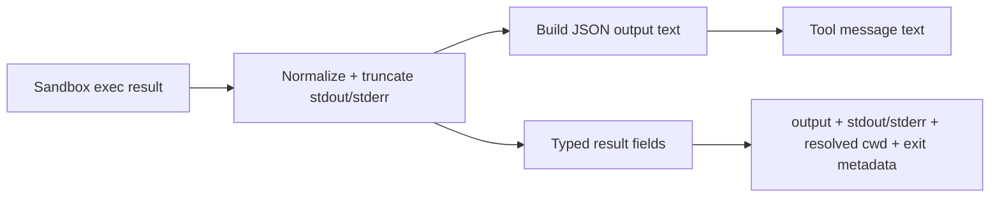

# Daycare Shell Exec: Structured Stream Output

## Summary
- Updated `packages/daycare/sources/plugins/shell/tool.ts`:
  - `exec` tool now returns a typed `output` field instead of `summary`.
  - `exec` tool now includes structured `stdout` and `stderr` fields in typed output/details when present.
  - `exec` tool now reports `cwd` as the resolved execution path (instead of usually returning `"."`).
  - `formatExecOutput()` now returns JSON-structured stream output instead of line-prefix formatting.
- Updated `packages/daycare/sources/plugins/shell/tool.spec.ts`:
  - Replaced `stdout:`/`stderr:` prefix assertions with structured JSON assertions.
  - Added assertion that exec typed result exposes `output` (and no `summary` field).

## Why
- Prefix-based stream formatting (`stdout:\n...`) is harder to parse reliably.
- Structured fields let downstream callers inspect streams directly without string slicing.
- Renaming `summary` to `output` for `exec` aligns the return shape with command output semantics.
- Returning resolved `cwd` preserves useful location context for callers.

## Exec Output Flow

