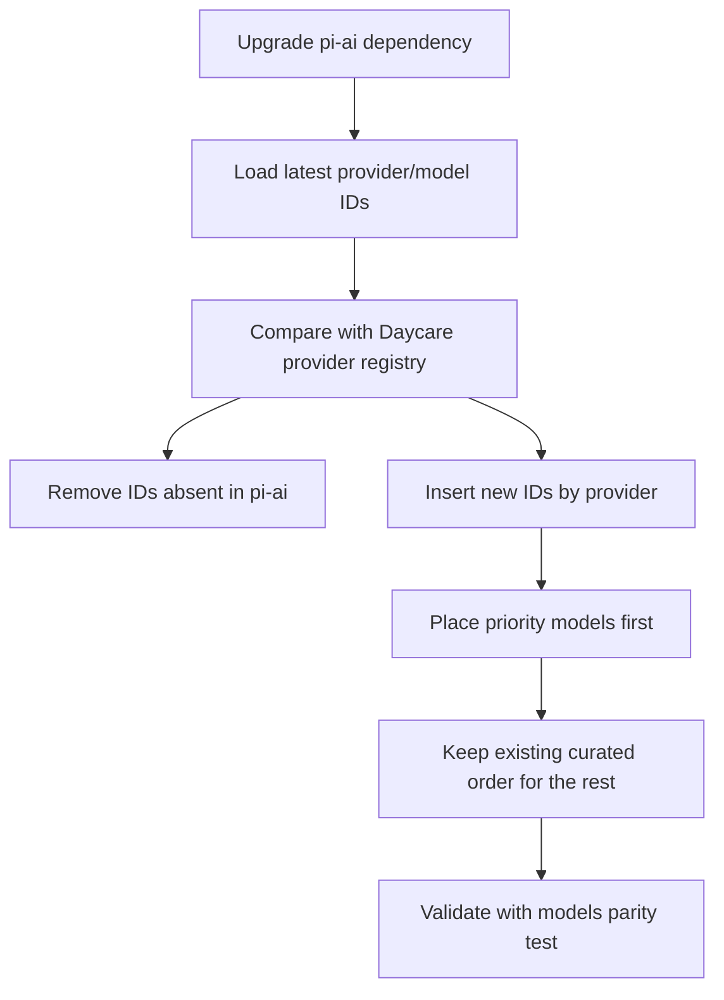

# pi-ai Model Catalog Refresh

## Summary
- Upgraded `@mariozechner/pi-ai` from `0.50.3` to `0.55.3`.
- Updated `packages/daycare/sources/providers/models.ts` so every provider/model ID matches the new `pi-ai` catalog.
- Added newly introduced models per provider with priority-first ordering so flagship models appear first instead of appending a random list.
- Kept existing curated entries where possible and removed IDs no longer present in `pi-ai`.
- Updated selector test expectations where the top `large` Anthropic model is now `claude-opus-4-6`.

## Ordering Rule Applied
- Existing curated order was preserved.
- New models were inserted provider-by-provider with explicit priority IDs at the top.
- Remaining new IDs were appended after existing curated entries.

