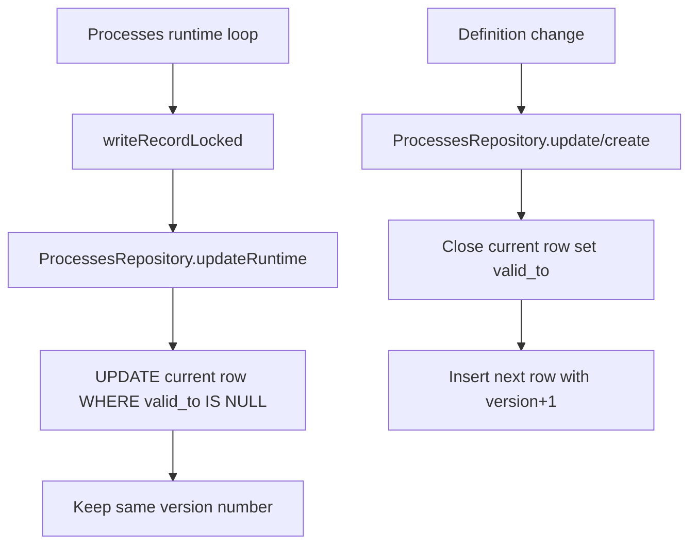

# Process Runtime In-Place Updates

## Summary

Process versioning remains the default:

- `ProcessesRepository.create(...)` advances version when the process id already exists.
- `ProcessesRepository.update(...)` always advances version.

A new runtime-only path now writes technical state in place:

- `ProcessesRepository.updateRuntime(...)`
- Used by `Processes.writeRecordLocked(...)` in `engine/processes/processes.ts`

This avoids creating a new version for restart/status churn while preserving version history for process definition changes (for example command changes).

## Runtime Fields (In-Place)

`updateRuntime(...)` updates only technical lifecycle fields:

- `desiredState`
- `status`
- `pid`
- `bootTimeMs`
- `restartCount`
- `restartFailureCount`
- `nextRestartAt`
- `settingsPath`
- `logPath`
- `createdAt`
- `updatedAt`
- `lastStartedAt`
- `lastExitedAt`

## Flow

