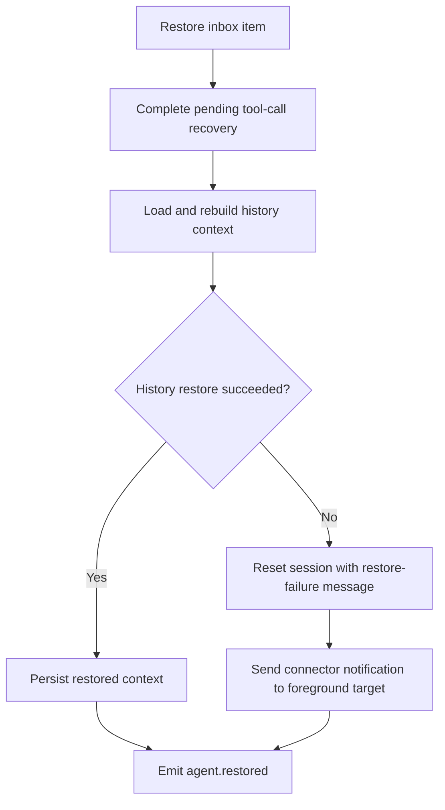

# Restore Failure Fallback Notification

## Summary

When agent history restore fails (for example, malformed timestamp data in persisted history), the restore flow now resets the session and sends a foreground notification:

`Session restore failed - starting from scratch.`

This prevents restore inbox items from failing hard and makes the fallback visible to the user.

## Flow

