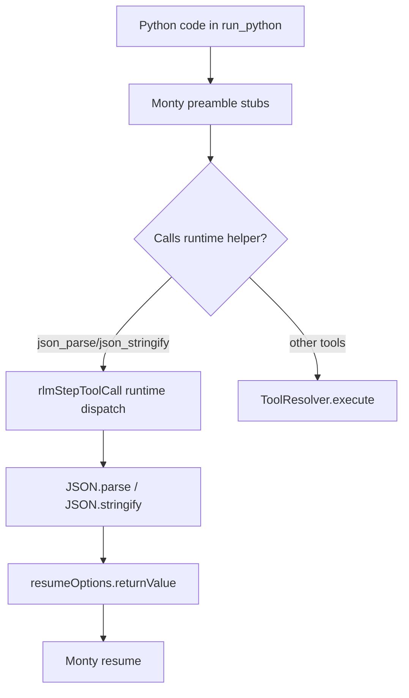

# RLM JSON Runtime Operations

Added two runtime-only RLM helper operations for JSON conversion without Python stdlib modules:

- `json_parse(text=...)["value"]`
- `json_stringify(value=..., pretty=True|False)["value"]`

These helpers are synthetic runtime operations. They are exposed in generated Monty preambles and executed directly in
RLM dispatch (not via `ToolResolver.execute`).

