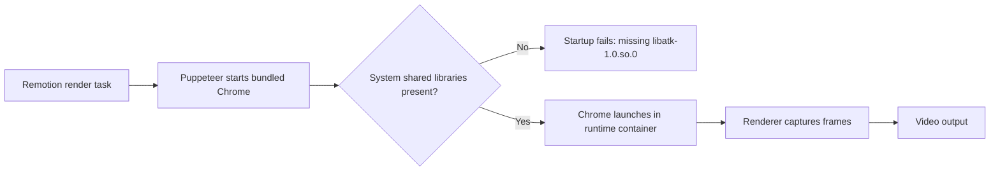

# Daycare Runtime: Add Chrome Shared Libraries

## Summary
- Updated both runtime images:
  - `packages/daycare-runtime/Dockerfile`
  - `packages/daycare-runtime/Dockerfile.minimal`
- Added Chrome/Puppeteer runtime dependencies for Ubuntu 24.04:
  - `libasound2t64`
  - `libatk1.0-0t64`
  - `libatk-bridge2.0-0t64`
  - `libatspi2.0-0t64`
  - `libcairo2`
  - `libcups2t64`
  - `libdbus-1-3`
  - `libdrm2`
  - `libgbm1`
  - `libglib2.0-0t64`
  - `libgtk-3-0t64`
  - `libnspr4`
  - `libnss3`
  - `libpango-1.0-0`
  - `libpangocairo-1.0-0`
  - `libx11-xcb1`
  - `libxcomposite1`
  - `libxdamage1`
  - `libxfixes3`
  - `libxkbcommon0`
  - `libxrandr2`
  - `libxshmfence1`
  - `libxss1`
  - `libxtst6`
  - `fonts-liberation`
  - `xdg-utils`

## Why
- Fixes headless Chrome launch failures during Remotion rendering in runtime containers.
- Ubuntu 24.04 provides several of these as `t64` package names while still exposing classic shared library sonames (for example `libatk-1.0.so.0`).

## Browser Runtime Flow

