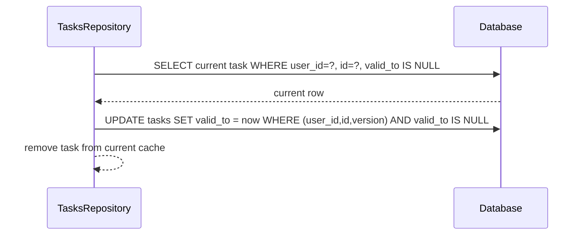
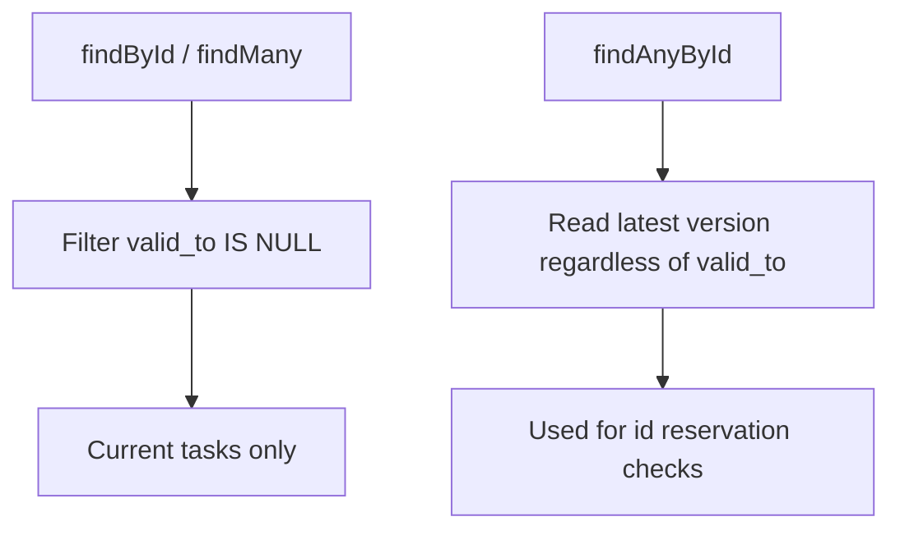

# Task Delete Uses `valid_to` Only

## Summary

Task soft delete no longer uses `tasks.deleted_at`.

- Removed `deletedAt` from task schema and task storage types.
- Task delete now closes the current version by setting `valid_to`.
- Added migration `20260228_tasks_drop_deleted_at.sql` to drop `tasks.deleted_at`.

## Delete Flow

## Read Semantics

