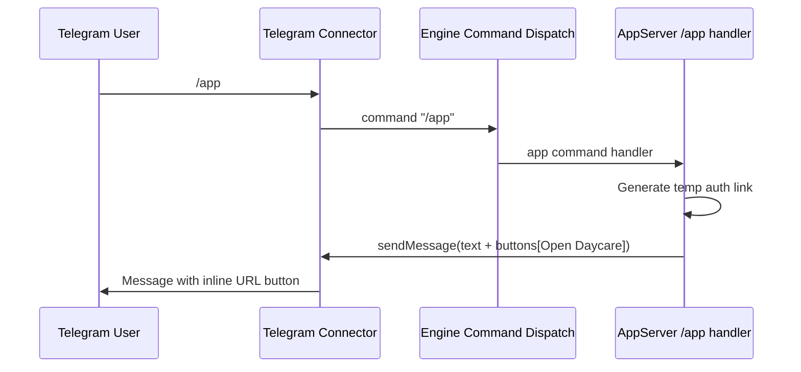

# Restore Telegram `/app` Slash Command Button Flow

Date: 2026-02-28

## Summary
- Restored `/app` command response behavior for Telegram after app server moved to core.
- Changed the `/app` response on Telegram to send a short text plus an inline URL button.
- Kept non-Telegram behavior unchanged (`/app` still returns the raw link in message text).
- Added connector-level support for optional message URL buttons and Telegram rendering.

## Flow

## Files
- `packages/daycare/sources/api/app-server/appServer.ts`
- `packages/daycare/sources/engine/modules/connectors/types.ts`
- `packages/daycare/sources/plugins/telegram/connector.ts`
- `packages/daycare/sources/api/app-server/appServer.spec.ts`
- `packages/daycare/sources/plugins/telegram/connector.spec.ts`
