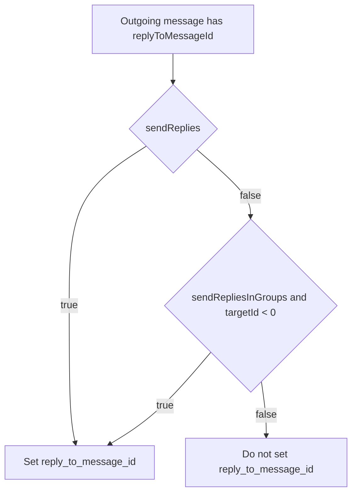

# Telegram reply defaults for private vs group chats

## Summary
- Changed Telegram plugin default `sendReplies` to `false` to stop threaded/quoted replies in private chats.
- Added `sendRepliesInGroups` (default `true`) so group/supergroup targets still use `reply_to_message_id`.

## Updated files
- `packages/daycare/sources/plugins/telegram/connector.ts`
- `packages/daycare/sources/plugins/telegram/connector.spec.ts`
- `packages/daycare/sources/plugins/telegram/plugin.ts`
- `packages/daycare/sources/plugins/telegram/plugin.spec.ts`
- `packages/daycare/sources/plugins/telegram/README.md`
- `doc/connectors/telegram.md`

## Decision flow

