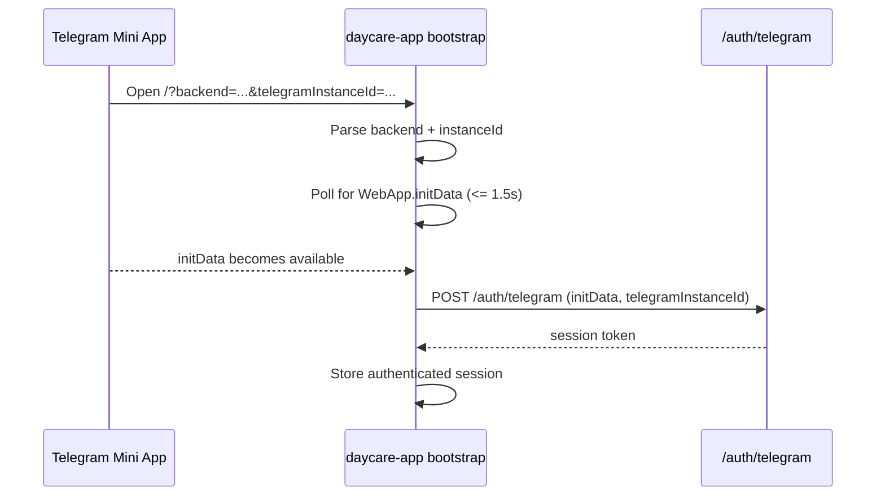

# Fix Telegram Mini App Home Auth Bootstrap

Date: 2026-02-28

## Summary
- Fixed Telegram Mini App home-open auth flow when `WebApp.initData` is injected after initial app bootstrap.
- Updated app bootstrap session resolver to wait briefly for Telegram `initData` before giving up.
- Added regression test for delayed `initData` arrival.

## Flow

## Files
- `packages/daycare-app/sources/modules/auth/authTelegramSessionResolve.ts`
- `packages/daycare-app/sources/modules/auth/authTelegramSessionResolve.spec.ts`
