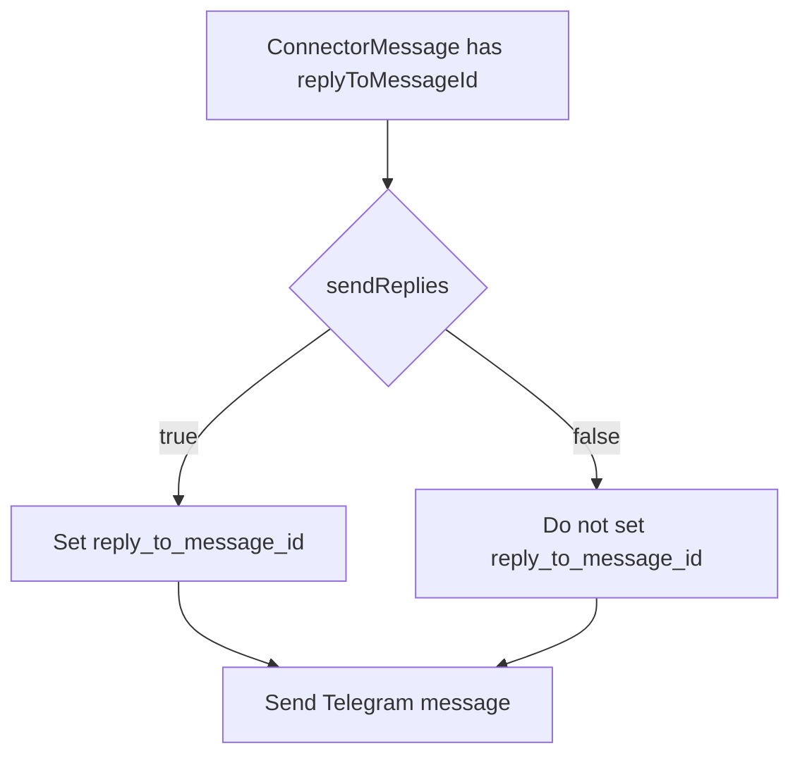

# Telegram sendReplies toggle

## Summary
- Added a Telegram plugin setting `sendReplies` to control whether outgoing messages include `reply_to_message_id`.
- Default behavior is unchanged (`sendReplies: true`), but setting it to `false` disables quoted replies.

## Updated files
- `packages/daycare/sources/plugins/telegram/connector.ts`
- `packages/daycare/sources/plugins/telegram/connector.spec.ts`
- `packages/daycare/sources/plugins/telegram/plugin.ts`
- `packages/daycare/sources/plugins/telegram/plugin.spec.ts`
- `packages/daycare/sources/plugins/telegram/README.md`
- `doc/connectors/telegram.md`

## Flow

