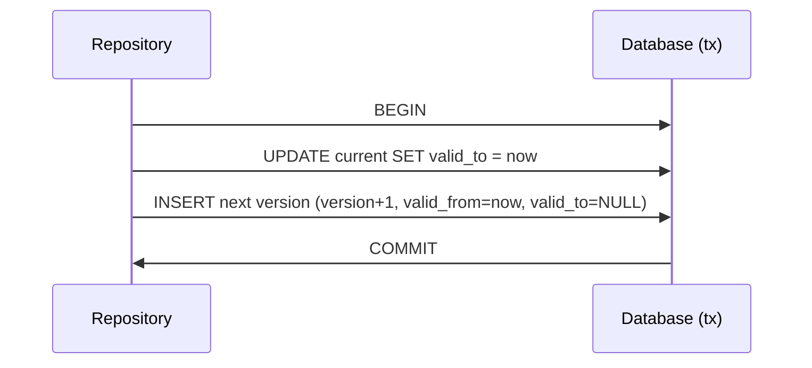
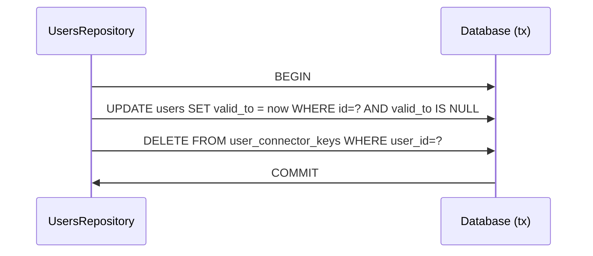

# Version Advance Atomicity and Connector Key Lifecycle

## Summary

This change addresses two correctness issues:

- Version advancement now executes inside a database transaction at every repository call site.
- User delete now removes `user_connector_keys` rows in the same transaction as closing the current user row.

## Atomic Version Advance

If insert fails, transaction rollback keeps the previous row current.

## User Delete + Connector Keys

This allows `resolveUserByConnectorKey(...)` to create a fresh user after deletion without unique-key conflicts.

## Migration

A cleanup migration removes stale connector keys already pointing to users with no current version:

- `20260228_user_connector_keys_cleanup.sql`
