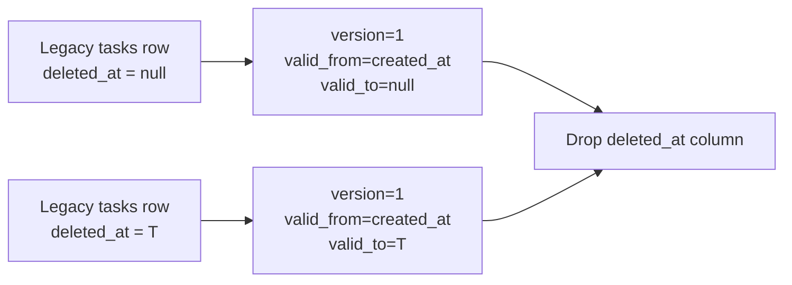
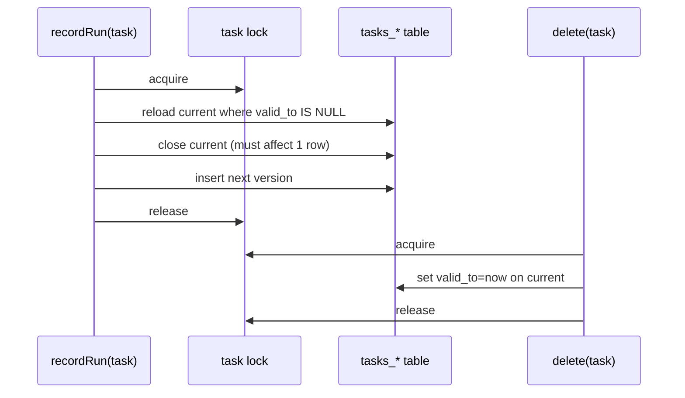

# 20260228 Versioning Migration And Race Guards

## Summary
- Fixed task migration backfill so legacy soft-deleted tasks remain deleted after `deleted_at` is dropped.
- Hardened `versionAdvance` to require exactly one closed current row before inserting the next version.
- Prevented delete-vs-`recordRun` resurrection races for heartbeat/webhook triggers by combining per-task locks with fresh reads.
- Added pair-level lock coverage for `connections.clearSide` and `connections.delete`.

## Migration Backfill

## Concurrent Delete vs recordRun

## Notes
- Regression tests added for:
  - Migration from pre-versioning schema with existing deleted tasks.
  - Deterministic delete-vs-`recordRun` races for webhook and heartbeat trigger repositories.
- Full `packages/daycare` typecheck and test suite pass with these changes.
