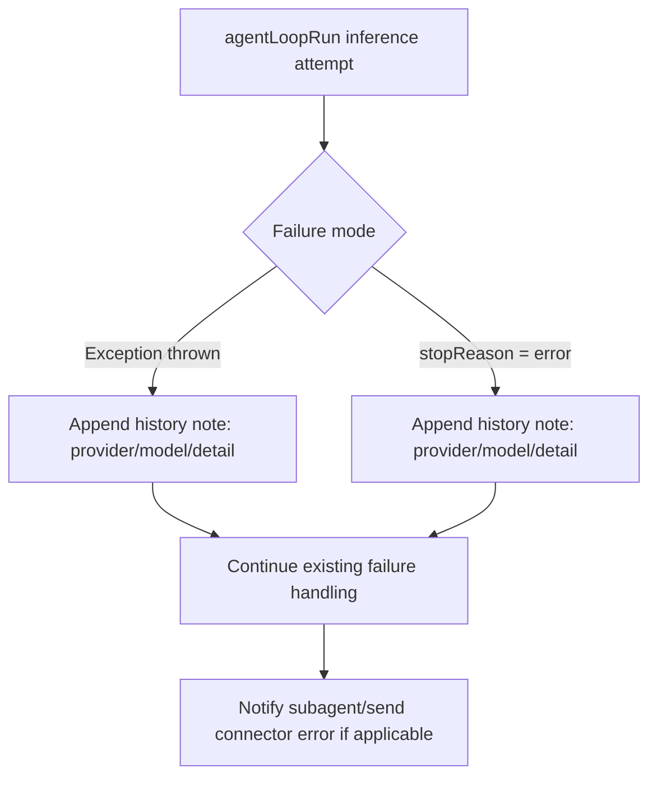

# Agent History Inference Failure Notes

## Summary

Inference failures are now persisted as `note` records in agent history.

Changes:
- Added a best-effort history note append when the inference loop throws.
- Added a history note append when inference returns `stopReason: "error"`.
- Included provider/model identifiers and normalized error detail in the note text.
- Truncated long error details before writing to history records.

## Flow

