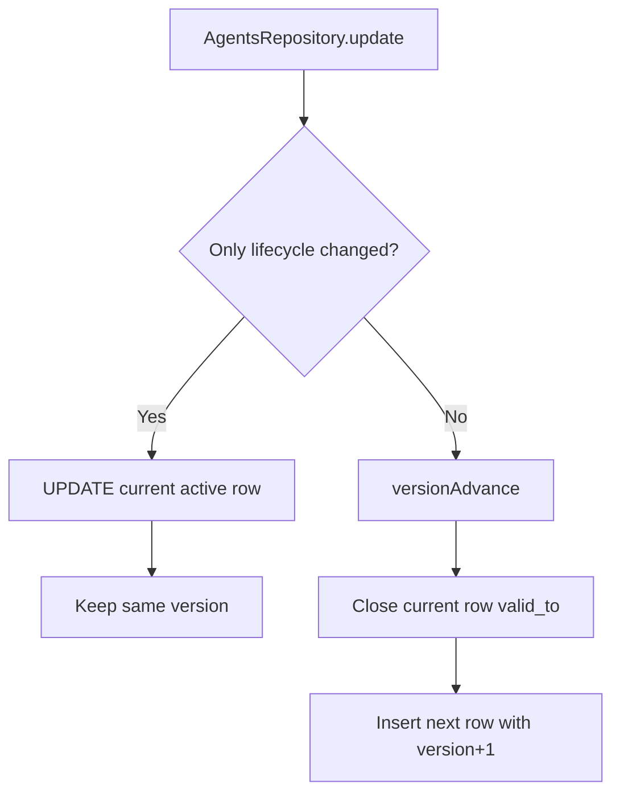

# Agent Lifecycle In-Place Update

## Summary

`AgentsRepository.update(...)` now keeps the same row/version when the effective change is lifecycle-only.

- If only `lifecycle` (and `updatedAt`) changed, repository runs `UPDATE` on the current row.
- Any other agent field change still uses temporal versioning (`valid_to` close + `version + 1` insert).

This avoids creating extra agent versions for lifecycle churn.

## Flow

