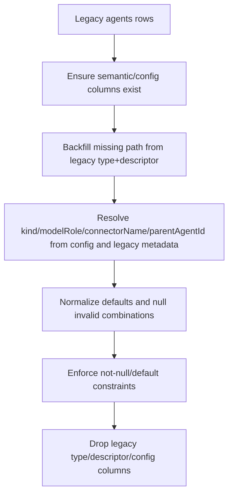
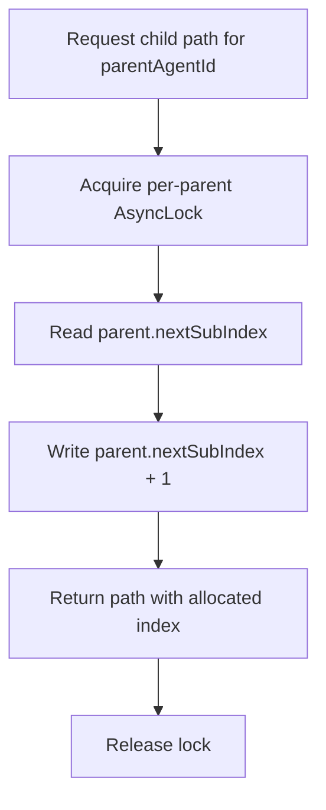

# 20260301 Agent Migration: Config-First Semantics and Child Path Allocation Lock

## Summary

This change removes path-derived semantic backfills from the `20260301` agent migrations and makes child path allocation safe under concurrent calls.

- Agent semantic columns (`kind`, `model_role`, `connector_name`, `parent_agent_id`) are backfilled from config/legacy metadata, not path parsing.
- `agentPathChildAllocate` now serializes allocation by `parentAgentId` to avoid duplicate child indexes.

## Migration flow

## Child allocation flow

## Why

- Path parsing for semantic data couples routing shape to persistence semantics and creates fragile migrations.
- Split read/write allocation without a shared lock can return duplicate child indexes during parallel tool calls.
