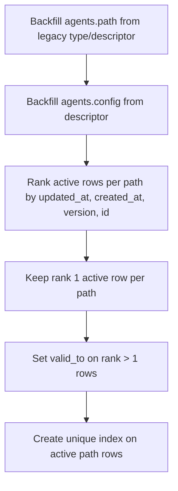

# 20260301 Agent Paths: Active-Path Deduping Before Unique Index

## Summary

`20260301_agents_unified.sql` closes duplicate active rows that resolve to the same `agents.path` before creating `idx_agents_path_active`.

This prevents migration failure on legacy data where multiple active agents map to one logical path (for example `/system/task`).

## Migration flow

## Why

- Existing deployments can have legacy duplicates with `valid_to IS NULL`.
- Creating the unique active-path index without cleanup fails migration startup.
- Closing older duplicates preserves one canonical active row per path and unblocks migration.
