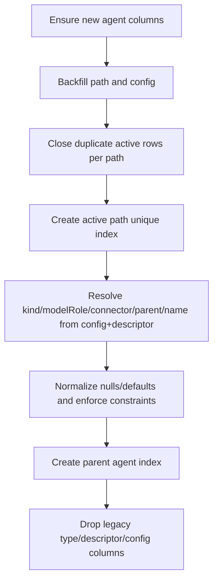

# 20260301 Agents Unified Migration

## Summary

Merged the three agent migrations into a single migration file:

- Removed: `20260301_agent_paths.sql`
- Removed: `20260301_agents_remove_descriptors.sql`
- Removed: `20260301_agents_config_semantics.sql`
- Added: `20260301_agents_unified.sql`

The unified step now performs path backfill, active-path dedupe, semantic backfill, normalization, index creation, and legacy column removal in one transaction.

## Flow

## Why

- Single migration boundary makes ordering explicit and avoids inter-file coupling.
- Reduces migration bookkeeping and keeps agent schema evolution in one place.
- Preserves the duplicate-active-path safety fix before uniqueness enforcement.
