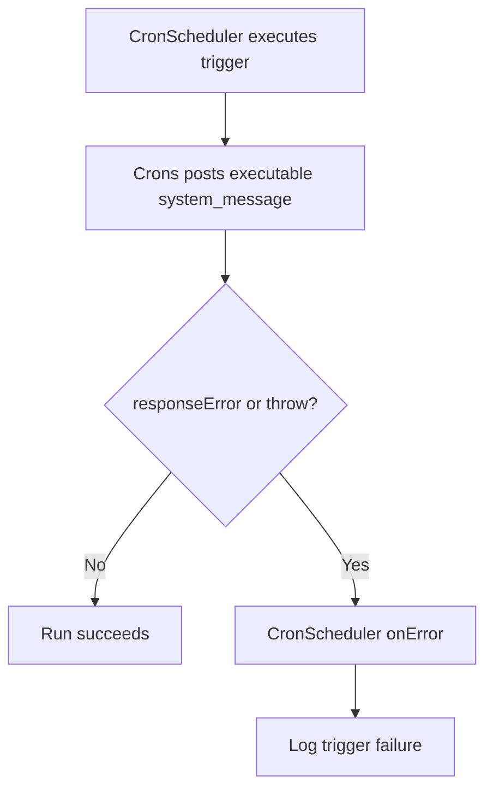

# Cron Failure Reporting

## Summary

Cron task failures are now surfaced by the original executable system-message result.

Changes:
- Executable system messages now preserve `responseError` even when not running in `sync` mode.
- Cron execution treats `responseError` as a task failure.
- Cron `onError` logs scheduler-level failure details.
- No secondary `cron:failure` or `<origin>:failure` message is re-posted by cron or agent-system layers.

## Flow

