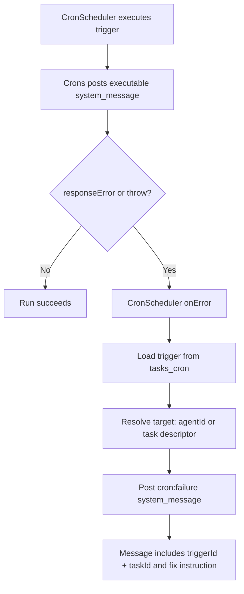

# Cron Failure Reporting

## Summary

Cron task failures now produce a follow-up system message instead of only logging.

Changes:
- Executable system messages now preserve `responseError` even when not running in `sync` mode.
- Cron execution treats `responseError` as a task failure.
- Cron `onError` now posts a `cron:failure` system message with:
  - `triggerId`
  - `taskId`
  - failure detail
  - instruction to try fixing the task before the next run
- Failure report routing now matches execution routing:
  - explicit `agentId` when set on the trigger
  - otherwise task descriptor `{ type: "task", id: taskId }`

## Flow

