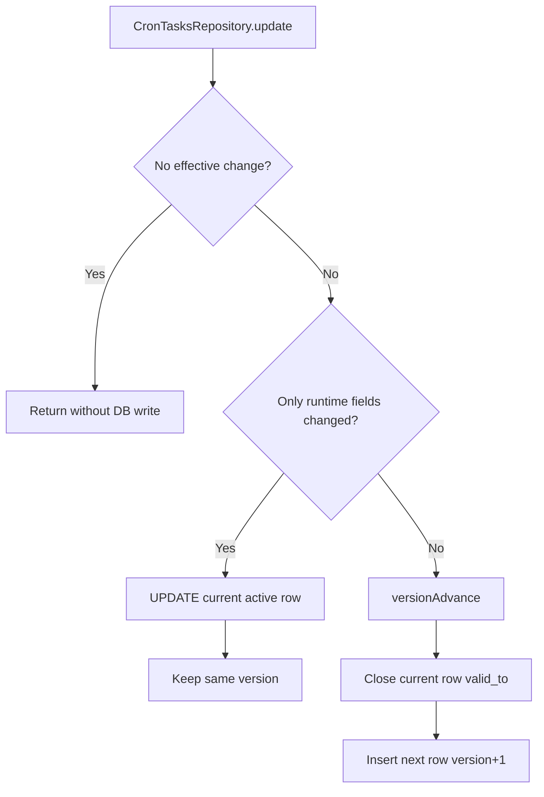

# Cron Runtime In-Place Updates

## Summary

`CronTasksRepository.update(...)` now avoids unnecessary `tasks_cron` version churn:

- No-op updates are skipped.
- Runtime-only updates (`lastRunAt`, `updatedAt`) are applied in place on the current row.
- Definition changes still use temporal versioning (`valid_to` close + `version + 1` insert).

This keeps cron execution metadata updates from creating a new trigger version on every run.

## Runtime Fields (In-Place)

- `lastRunAt`
- `updatedAt`

## Flow

