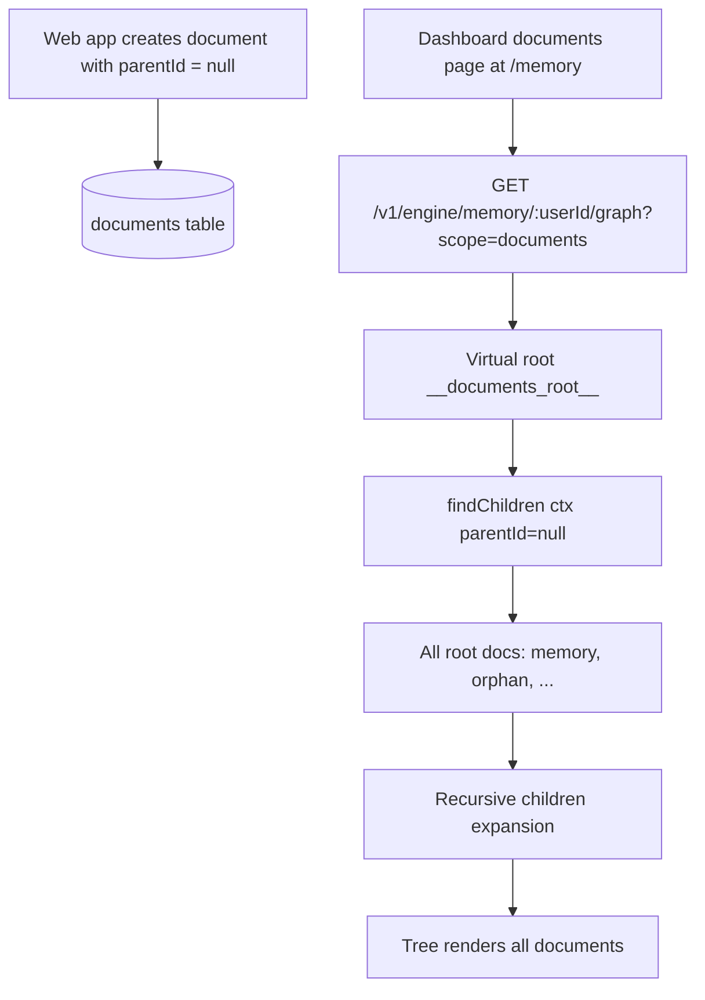

# Dashboard document scope for root-level documents

The dashboard memory page previously requested only the memory subtree (`scope=memory`, implicit default), which excluded documents created at root (`parentId: null`) from the web app.

## What changed

- Added optional `scope` query support to engine memory graph routes:
  - `scope=memory` (default): existing behavior rooted at `~/memory`.
  - `scope=documents`: virtual root that includes all top-level documents and their descendants.
- Updated dashboard client helpers to pass route scope parameters.
- Updated dashboard `/memory` page to load `scope=documents` so root-level webapp documents appear.
- Added engine route tests covering `scope=documents` graph and node reads.

## Flow

