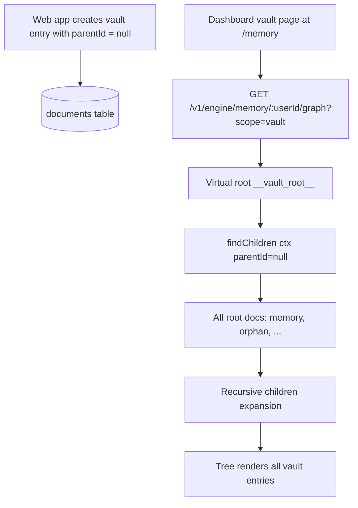

# Dashboard vault scope for root-level vault entries

The dashboard memory page previously requested only the memory subtree (`scope=memory`, implicit default), which excluded vault entries created at root (`parentId: null`) from the web app.

## What changed

- Added optional `scope` query support to engine memory graph routes:
  - `scope=memory` (default): existing behavior rooted at `vault://memory`.
  - `scope=vault`: virtual root that includes all top-level vault entries and their descendants.
- Updated dashboard client helpers to pass route scope parameters.
- Updated dashboard `/memory` page to load `scope=vault` so root-level webapp vault entries appear.
- Added engine route tests covering `scope=vault` graph and node reads.

## Flow

```mermaid
flowchart TD
    A[Web app creates vault entry with parentId = null] --> B[(documents table)]
    C[Dashboard vault page at /memory] --> D[GET /v1/engine/memory/:userId/graph?scope=vault]
    D --> E[Virtual root __vault_root__]
    E --> F[findChildren ctx parentId=null]
    F --> G[All root docs: memory, orphan, ...]
    G --> H[Recursive children expansion]
    H --> I[Tree renders all vault entries]
```
