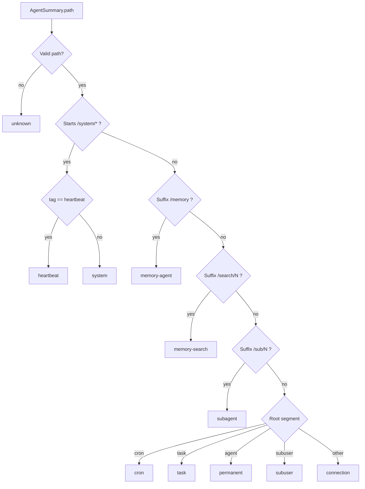

# Dashboard Path-Based Agent Rendering

## Summary

The dashboard now renders agent identity and type from `path` instead of `descriptor`.
This applies to both dashboard surfaces:

- Next.js dashboard package (`packages/daycare-dashboard`)
- Plugin static dashboard page (`sources/plugins/dashboard/site/dashboard.js`)

## Backend Response Update

`/v1/engine/agents` now includes path/config for each agent summary so dashboard clients can render without descriptor identity logic.

## Type Resolution Flow

## UI Changes

- Agents tables now show **Path** instead of **Descriptor**.
- Agent detail header now shows **Path** identity.
- Search/filter text uses `agent.path` + resolved type labels.
- Static dashboard type chip derives type from path patterns.
