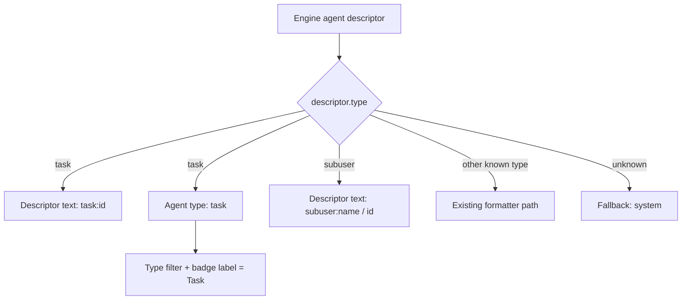

# Dashboard Task Descriptor Rendering

## Summary

Updated `daycare-dashboard` to render the new agent descriptor type:

- `{ type: "task", id: string }`

The dashboard now shows task agents as `task:<id>` and classifies them under `Task` in type labels and filters.

Also aligned dashboard descriptor parity for `subuser` so those descriptors no longer fall back to `system`.

## Rendering Flow

