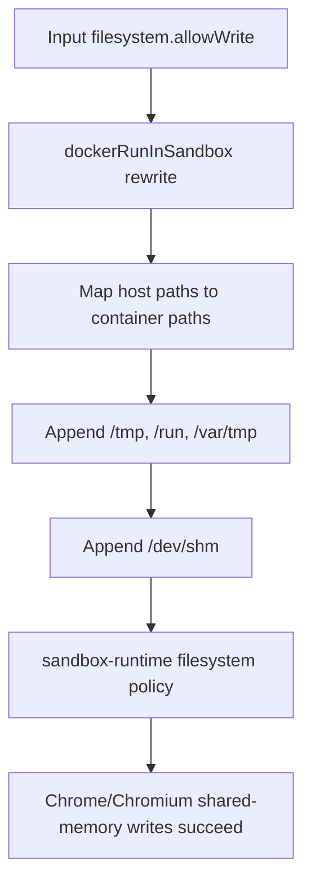

# Daycare Docker Sandbox: Allow Writes to /dev/shm

## Summary
- Updated Docker sandbox runtime policy to allow writes to `/dev/shm`.
- Replaces prior `/home/.tmp` write allowance in Docker `allowWrite` expansion.
- Keeps `TMPDIR=/tmp` normalization and 1 GiB Docker `ShmSize` behavior.

## Code Changes
- `packages/daycare/sources/sandbox/docker/dockerRunInSandbox.ts`
  - Added `/dev/shm` to appended `filesystem.allowWrite` paths.
  - Removed `/home/.tmp` from appended `filesystem.allowWrite` paths.
- `packages/daycare/sources/sandbox/docker/dockerRunInSandbox.spec.ts`
  - Updated expected rewritten `allowWrite` list to include `/dev/shm`.
- `packages/daycare/sources/sandbox/docker/README.md`
  - Updated Docker sandbox documentation for shared-memory write path.

## Policy Flow

