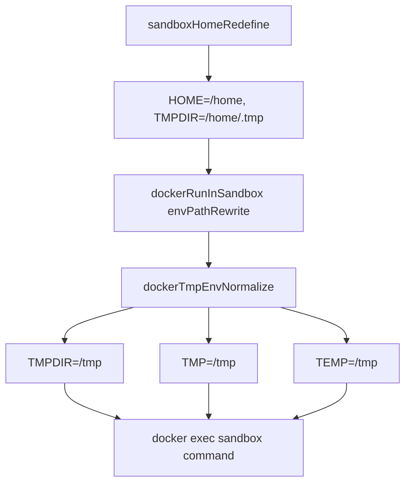

# Daycare Docker Sandbox: Force TMPDIR=/tmp for Chrome

## Summary
- Updated Docker sandbox command execution to force `TMPDIR`, `TMP`, and `TEMP` to `/tmp`.
- Keeps host-mode behavior unchanged (`sandboxHomeRedefine` can still use `<home>/.tmp` outside Docker).
- Prevents Chrome runtime errors when Chromium tries to use `/home/.tmp` and hits permission issues.

## Code Changes
- `packages/daycare/sources/sandbox/docker/dockerRunInSandbox.ts`
  - Added Docker-only temp env normalization (`/tmp`).
- `packages/daycare/sources/sandbox/docker/dockerRunInSandbox.spec.ts`
  - Updated expectations for `TMPDIR`, `TMP`, and `TEMP`.
- `packages/daycare/sources/sandbox/docker/README.md`
  - Documented Docker temp env override.

## Env Flow

