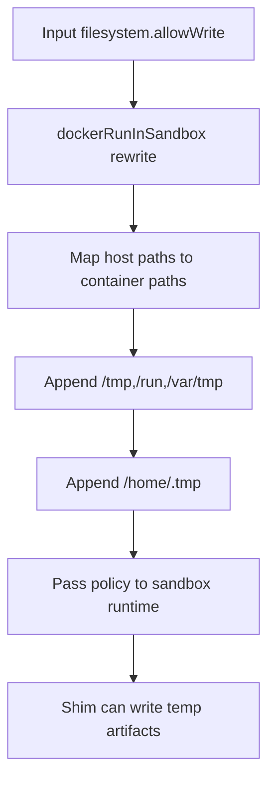

# Daycare Docker Sandbox: Allow Shim Writes in /home/.tmp

## Summary
- Added `/home/.tmp` to Docker sandbox `filesystem.allowWrite`.
- Keeps `TMPDIR=/tmp` override in place for Chrome stability.
- Ensures sandbox shim internals can still write temp artifacts in mounted home temp.

## Code Changes
- `packages/daycare/sources/sandbox/docker/dockerRunInSandbox.ts`
  - Added `/home/.tmp` to rewritten `allowWrite` list.
- `packages/daycare/sources/sandbox/docker/dockerRunInSandbox.spec.ts`
  - Updated `allowWrite` expectation to include `/home/.tmp`.
- `packages/daycare/sources/sandbox/docker/README.md`
  - Documented shim write allowance.

## Write Permission Flow

