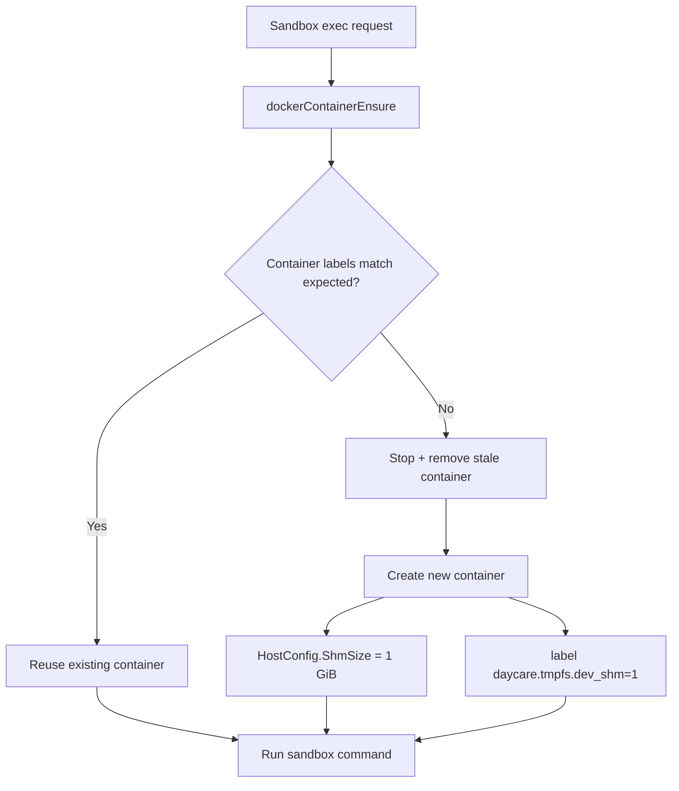

# Daycare Docker Sandbox: Increase /dev/shm for Chrome Stability

## Summary
- Updated Docker sandbox container creation to allocate 1 GiB shared memory.
- Added a new container metadata label to force stale-container replacement after rollout.
- Updated Docker sandbox docs to include the shared-memory behavior.

## Code Changes
- `packages/daycare/sources/sandbox/docker/dockerContainerEnsure.ts`
  - Added `HostConfig.ShmSize = 1024 * 1024 * 1024`.
  - Added label `daycare.tmpfs.dev_shm = "1"`.
  - Added stale checks for missing/mismatched `daycare.tmpfs.dev_shm`.
- `packages/daycare/sources/sandbox/docker/dockerContainerEnsure.spec.ts`
  - Updated container label expectations.
  - Updated `HostConfig` expectations with `ShmSize`.
  - Added coverage for missing `/dev/shm` label triggering container recreation.

## Why
Headless Chrome can crash in constrained container environments when `/dev/shm` is too small.
Docker defaults are often insufficient for browser automation workloads.

## Container Refresh Flow

