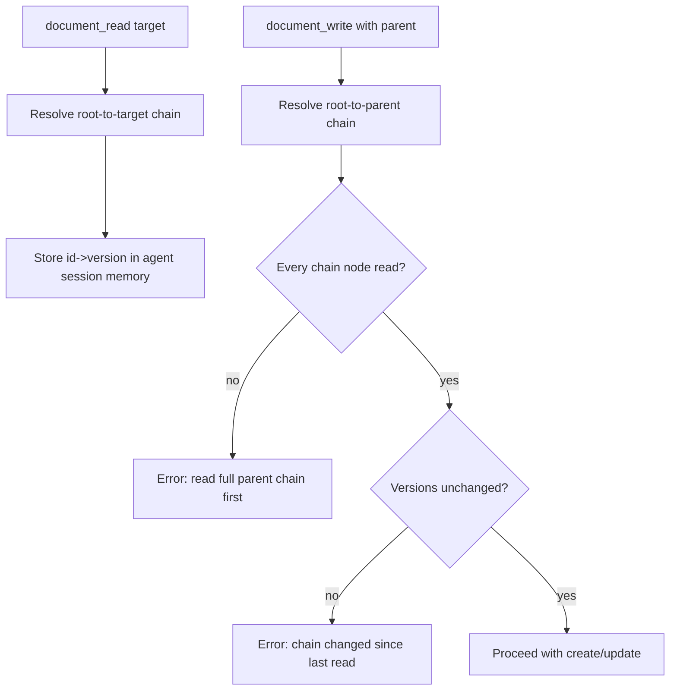

# Document Parent Chain Read Guard

## Summary

Document attach operations now require the parent chain to be fully read in the current agent session.

## Behavior

- `document_read` marks the full root-to-target chain (`~/...`) as read in the in-memory agent session state.
- `document_write` with `parentId` or `parentPath` verifies that every chain node:
  - was read in this session;
  - is still on the same version as when read.
- If any node is missing or stale, the write fails with an explicit error.

## Flow

