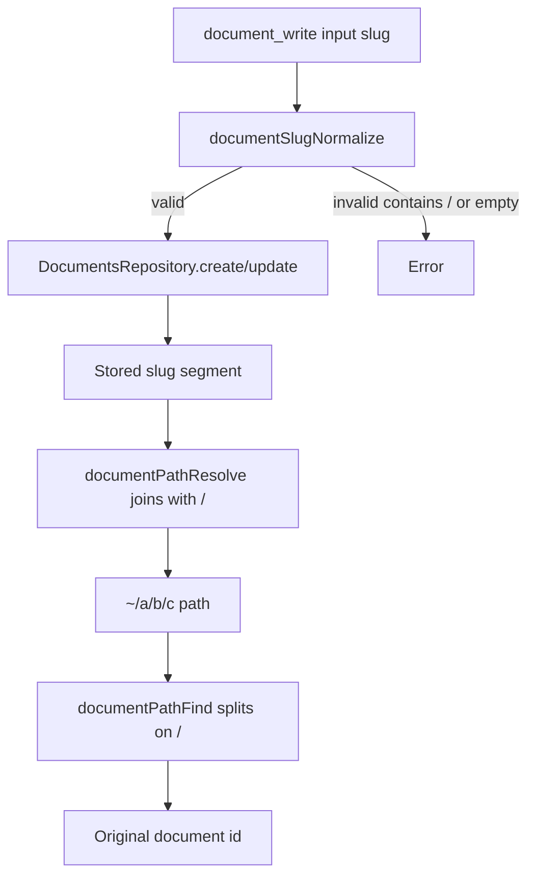

# Document Slug Validation

## Summary

This change makes document slugs path-safe so document paths like `~/memory/user` remain unambiguous.

## What Changed

- Added `documentSlugNormalize` to trim and validate slugs.
- Rejected slugs containing `/` in:
  - `document_write` tool input handling.
  - `DocumentsRepository` create/update/lookup normalization.
- Updated Python tooling guidance examples to use `document_read` instead of removed memory tools.
- Added tests for:
  - slug rejection in tool and repository layers.
  - path round-trip correctness for valid slugs.

## Validation Flow

