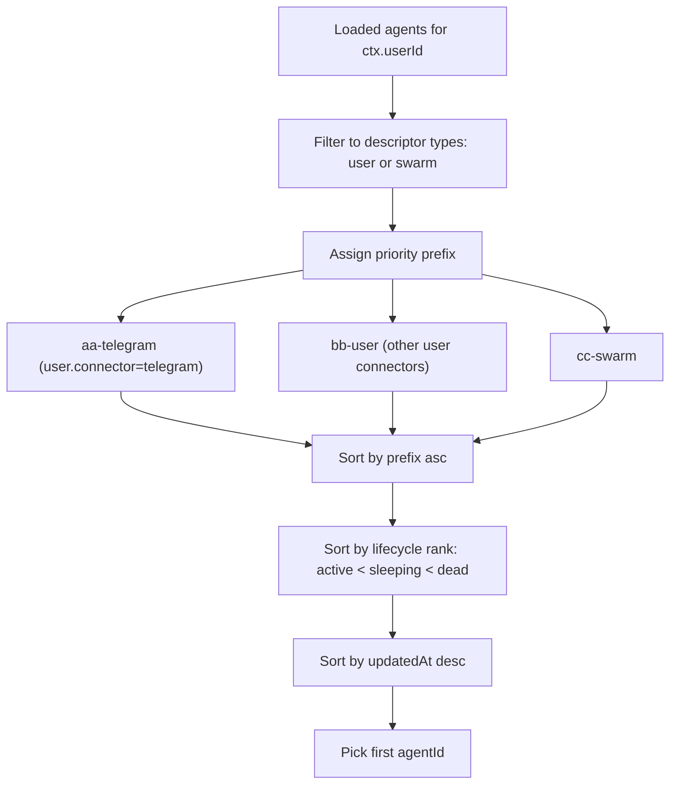

# Foreground Agent Selection Priority (2026-03-01)

## Summary

`most-recent-foreground` selection now prefers true user-facing agents only.

- Foreground candidates: `user`, `swarm`
- Non-foreground candidates (excluded): `permanent`, `task`, `cron`, `subagent`, memory agents
- Telegram `user` agents are explicitly prioritized using a prefixed priority key.
- Within the same priority bucket, selection prefers active lifecycle state, then newest `updatedAt`.

## Why

The previous fallback included non-user-facing agents and could select background/permanent workers.
This update makes default delivery target selection align with actual user-facing conversations.

## Selection Flow

