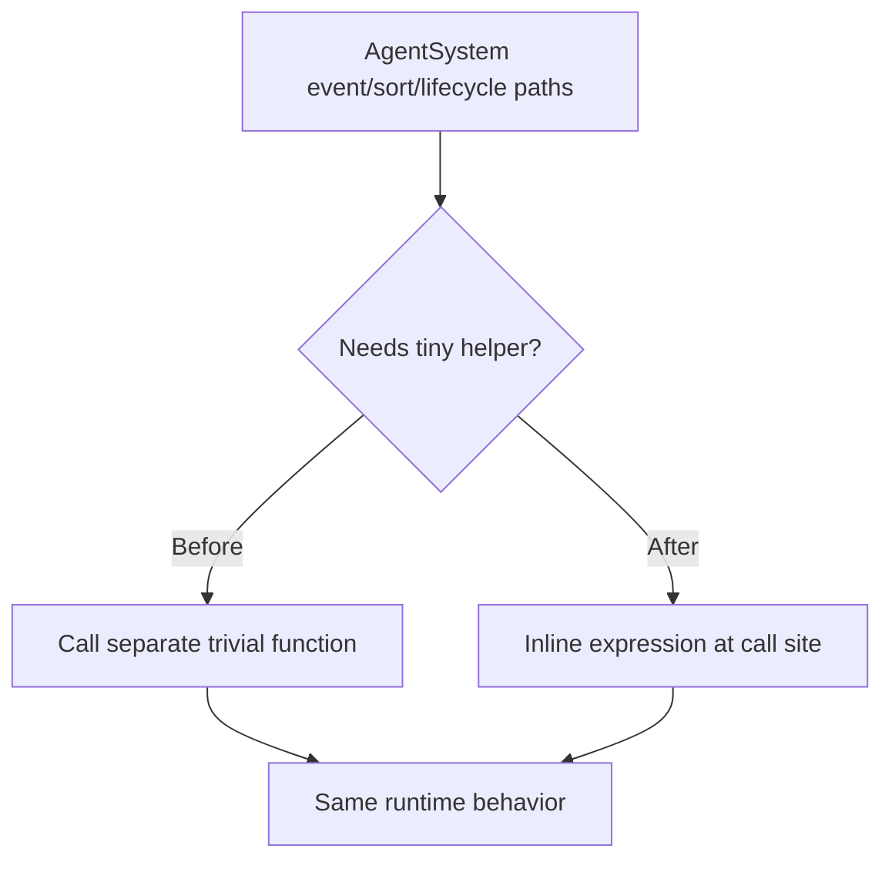

# Agent System Trivial Function Inlining

## Summary

Refactored `AgentSystem` by inlining trivial single-purpose helpers directly at call sites:

- foreground selection prefix mapping
- lifecycle state rank mapping
- lifecycle signal type string formatting
- dead-agent error creation
- poison-pill signal id parsing in event handling

This removes indirection for tiny one-liner helpers and keeps behavior unchanged.

## Flow

