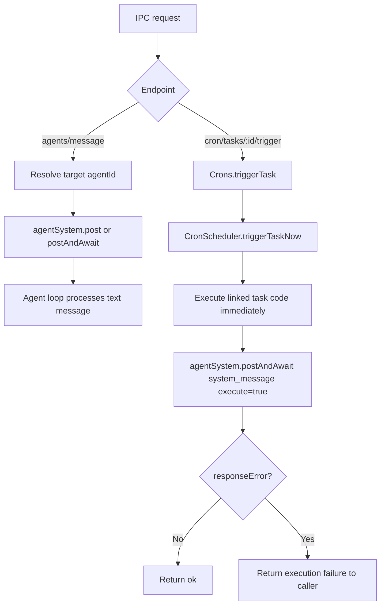

# IPC Agent Message and Manual Cron Trigger

## Summary

Added two IPC APIs for runtime debugging and integration testing:

- `POST /v1/engine/agents/message`
  - Sends plain text to an arbitrary agent target.
  - Supports either explicit `agentId` or descriptor-based routing (`{ type: "...", ... }`).
  - Optional `awaitResponse` returns the assistant response text for end-to-end checks.
- `POST /v1/engine/cron/tasks/:triggerId/trigger`
  - Executes a cron trigger immediately, outside schedule timing.
  - Returns trigger execution failures directly to the caller.

## Executable Prompt Failure Routing

Executable prompt failures now stay inline with normal system-message execution:

- `AgentSystem.postAndAwait` returns the original `system_message` result as-is.
- No synthetic `<origin>:failure` follow-up message is enqueued.
- `Crons` and `Webhooks` can treat `responseError: true` as execution failure in their own control flow.
- `Webhooks` now treats `responseError` as execution failure and throws.

## Flow

