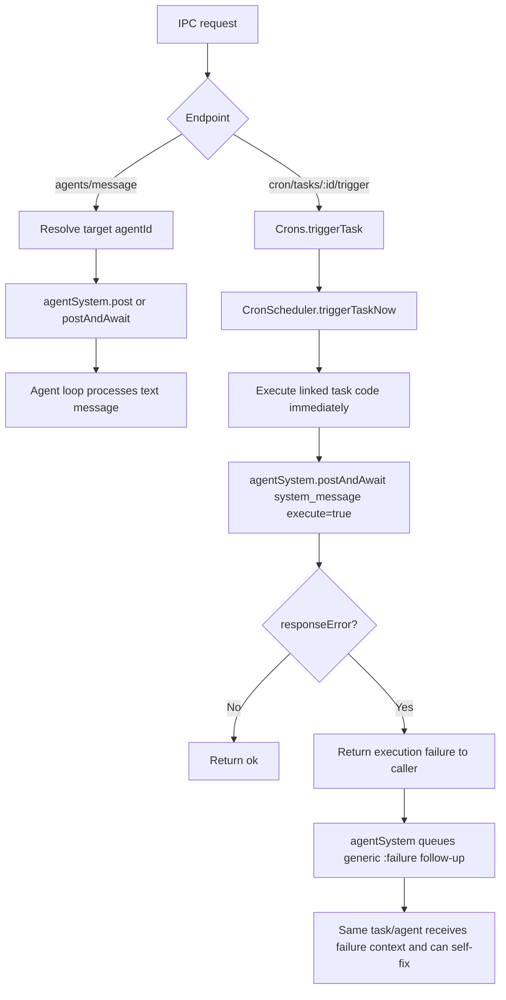

# IPC Agent Message and Manual Cron Trigger

## Summary

Added two IPC APIs for runtime debugging and integration testing:

- `POST /v1/engine/agents/message`
  - Sends plain text to an arbitrary agent target.
  - Supports either explicit `agentId` or descriptor-based routing (`{ type: "...", ... }`).
  - Optional `awaitResponse` returns the assistant response text for end-to-end checks.
- `POST /v1/engine/cron/tasks/:triggerId/trigger`
  - Executes a cron trigger immediately, outside schedule timing.
  - Returns trigger execution failures while failure follow-up is now handled by the agent layer.

## Executable Prompt Failure Routing

Failure remediation moved from cron-specific code into shared agent execution:

- Any `system_message` with `execute: true` and `responseError: true` now queues a generic follow-up message to the same target with origin `<origin>:failure`.
- Follow-up text includes:
  - original origin (`cron`, `webhook`, `task`, etc.)
  - original source payload text
  - extracted execution error text when available
- `Crons` no longer posts `cron:failure` directly.
- `Webhooks` now treats `responseError` as execution failure and throws.

## Flow

