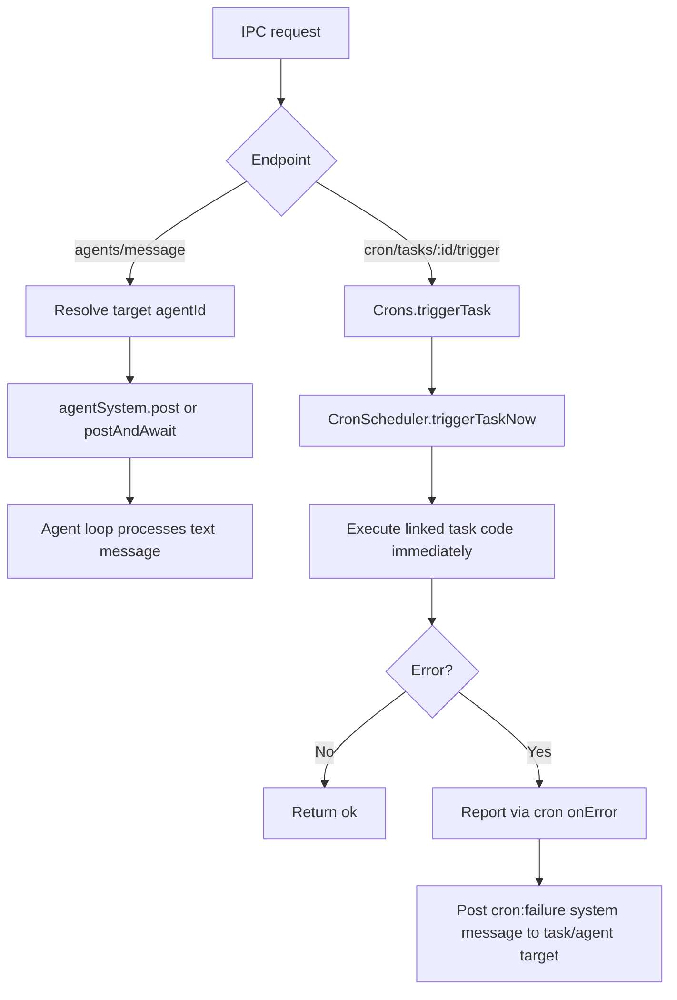

# IPC Agent Message and Manual Cron Trigger

## Summary

Added two IPC APIs for runtime debugging and integration testing:

- `POST /v1/engine/agents/message`
  - Sends plain text to an arbitrary agent target.
  - Supports either explicit `agentId` or descriptor-based routing (`{ type: "...", ... }`).
  - Optional `awaitResponse` returns the assistant response text for end-to-end checks.
- `POST /v1/engine/cron/tasks/:triggerId/trigger`
  - Executes a cron trigger immediately, outside schedule timing.
  - Preserves existing cron error reporting behavior (`onError` + failure follow-up message flow).

## Flow

