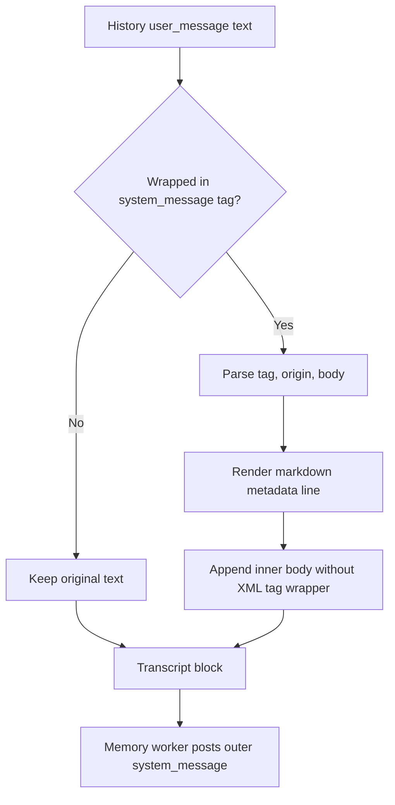

# Memory Worker System Envelope Formatting

## Why
Memory-worker batches are posted as outer `system_message` items. Some background sessions already contain `user_message.text` wrapped in `<system_message ...>...</system_message>`, which produced nested tags inside the transcript payload.

## What changed
- Updated `formatHistoryMessages` to detect full `system_message` and `system_message_silent` envelopes in `user_message.text`.
- Reformat those envelopes into markdown quote metadata (`> System message ...`) plus raw body content.
- Insert line breaks between adjacent XML-like tags in the normalized body for readability.
- Preserve `origin` metadata when present.
- Keep non-envelope text unchanged.

## Result
Memory-worker transcripts no longer embed inner `<system_message>` tags, avoiding nested envelope formatting while retaining source context.
