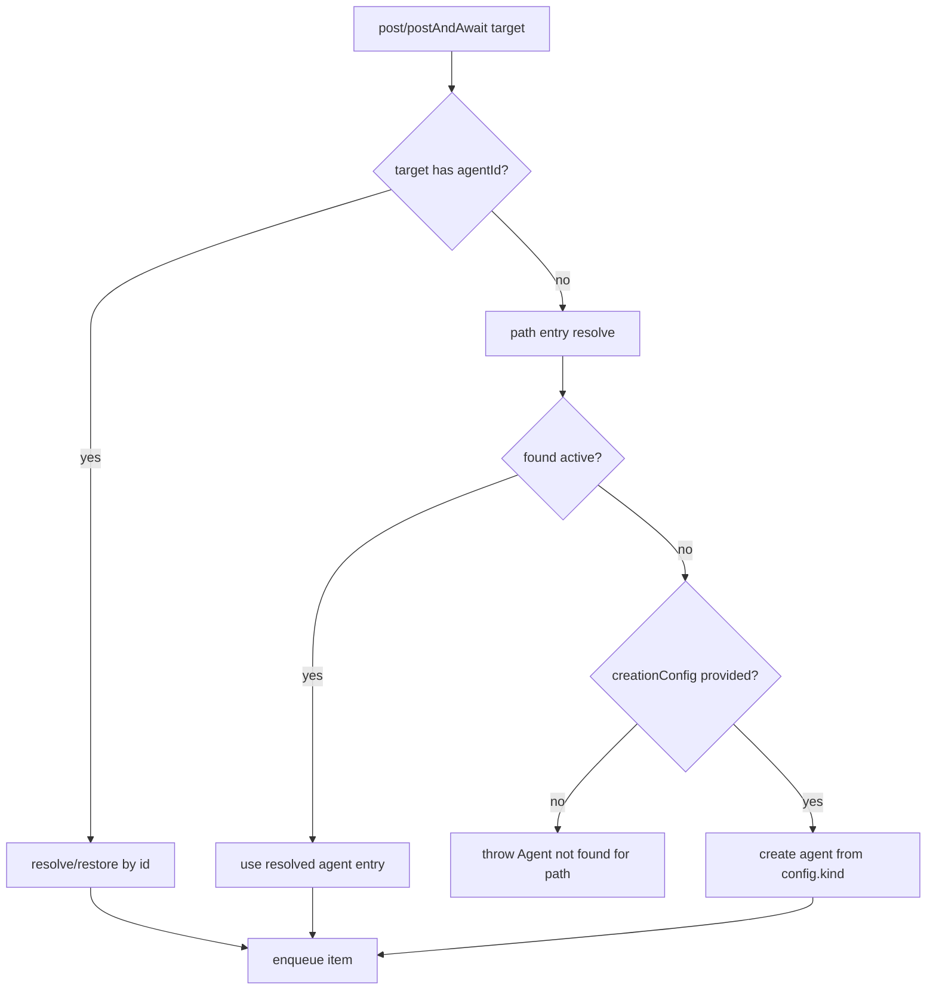
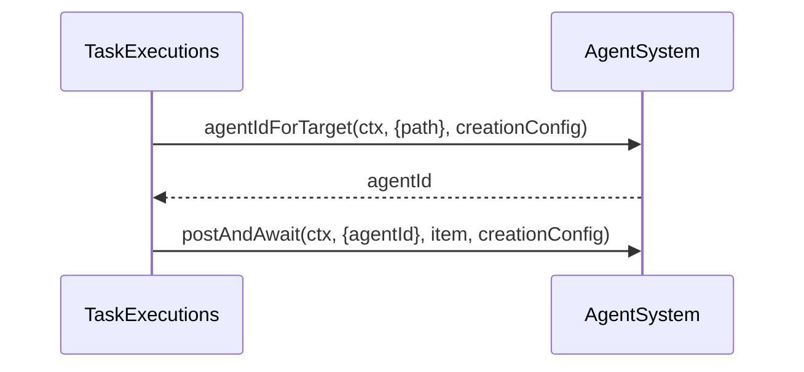

# Path Send Contract (Config-First)

This change enforces strict path-target behavior in `AgentSystem` and routes task dispatch through resolved `agentId`.

## Rules

- Path target **without** `creationConfig`: resolve existing active agent only.
- Path target **with** `creationConfig`: resolve existing first, create only if missing.
- Dead agents always throw.
- Task execution resolves path to `agentId` before posting.

## Flow

## Task Dispatch Behavior

